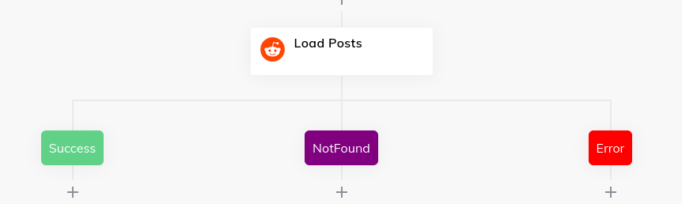
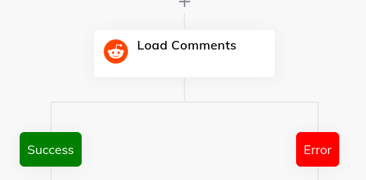

# cognigy-reddit-explorer

CognigyAI extension featuring the use of [cognigy-hammer](https://www.npmjs.com/package/cognigy-hammer). You can load Reddit Posts from a subreddit and their comments.

### Test in webchat

By accessing the webchat, you agree with [CognigyAI Trial Terms of Service](https://www.cognigy.com/free-trial-terms-and-conditions) and [CognigyAI Privacy Policy](https://www.cognigy.com/privacy-policy).

[https://webchat-trial.cognigy.ai/v2/17ca2fca93ed8b7a4c8d545ca91baa713dd517bfaac5a38795e256b19edd8aaf](https://webchat-trial.cognigy.ai/v2/17ca2fca93ed8b7a4c8d545ca91baa713dd517bfaac5a38795e256b19edd8aaf)

### Nodes

